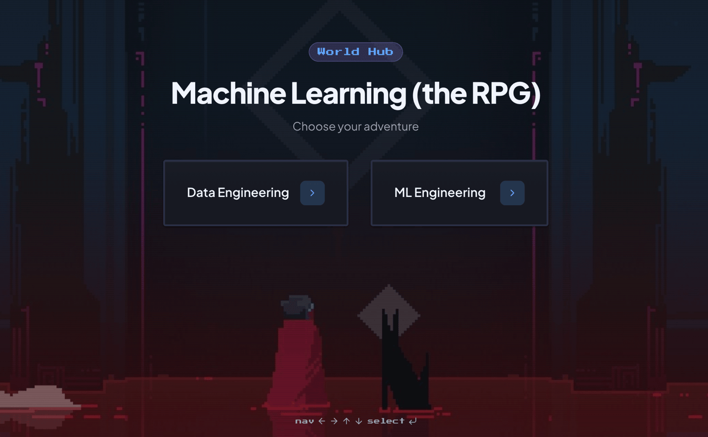

# Machine Learning (the RPG)

A gamified learning course platform for ML & Data Engineering content. Built on SolidStart.

## Summary

A retro video game-themed (Hyperlight Drifter inspired) content-navigation site with a built-in leveling system (just like an RPG!):

1. **World** (course) — a high-level curriculum
2. **Level** (category) — a topical category within a world
3. **Quest** (section) — a specific subject within a level
4. **Objective** (lesson) — an individual lesson with its own page and external links

Each objective/lesson awards XP when completed. Players level up gradually through 20 ranks as lessons are completed. Progress is tracked server-side, or locally in the browser if no login is detected. No paywall or restricted content, login is purely for global "saving".

## Core Features

### Course Information

- Currently only 2 courses, machine learning engineering and data engineering
- Each world has roughly 10-20 categories/levels
- Each level contains 5-10 sections/quests
- Each section contains 5-7 lessons/objectives
- Total lessons is about ~1000 lessons
  
### XP & Leveling system

- Each objective awards a multiple of `25 XP` (objective 1 = 25 XP, objective 6 = 150 XP)
- 20 ranks from Novice (0) to Eternal (20), gradual increasing difficulty curve
- Level 20 requires 60,000 XP (~87,000 is total available XP if all ~1000 lessons are completed)

### Player Tracking

- Login is completely optional, default user is Anon.
- For guest/anonymous users, all data is tracked in the browser, fully local.
- Player stats are rendered as RPG-style player HUD, shows dynamic XP and level status
- Custom avatars with each rank, border glows at higher ranks

### Read Tracking

- Objectives are marked complete when a user reads the full lesson
- Users can manually reset progress on the quest page, or in the Player HUD detailed stats section
- XP earned animations (+XP)

---

## Motivation

I created this repo to initially learn about ML/Data engineering topics, but eventually turned it into a fun playground to practice new web development libraries and RAG/agentic workflows and implementation. Also practicing my frontend design UI/UX skills. Truly meta-level learning on learning action.

## Development

For a full breakdown of the repo architecture, tech stack, configuration, and local development setup, check out [AGENTS.md](AGENTS.md).

## License

MIT. Do what you will. [LICENSE.md](LICENSE.md). 
